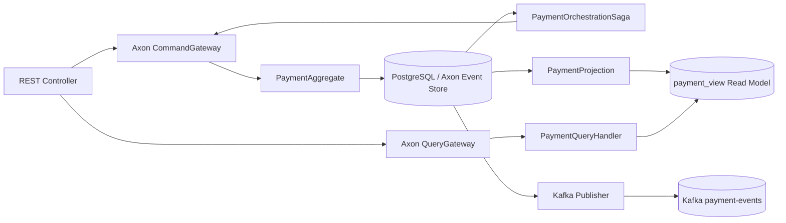

# Axon Saga Orchestration PoC - Payment Processing

PoC en **Java 25**, **Spring Boot 3.5**, **Axon Framework 4.13 sin Axon Server**, **PostgreSQL 17** y **Apache Kafka 4.0**. Implementa un microservicio REST con DDD, CQRS, Event Sourcing y Saga por **orquestación** con compensaciones.

## Funcionalidad

El caso de uso es procesamiento de pagos:

1. Se crea un pago.
2. La Saga orquestadora reserva fondos.
3. La Saga valida fraude.
4. Si fraude aprueba, captura el pago.
5. Si fraude rechaza, ejecuta compensación: libera fondos y cancela el pago.
6. Si falla la reserva, cancela el pago.

## Arquitectura



## Estructura

```text
src/main/java/com/edgarrt/poc/payments
├── domain
│   ├── command        # Commands Axon
│   ├── event          # Domain events
│   ├── query          # Queries Axon
│   └── model          # Aggregate y enums de dominio
├── application
│   ├── orchestration  # Saga orquestadora
│   ├── projection     # Read model CQRS
│   └── query          # Query handlers
└── infrastructure
    ├── kafka          # Publicación externa a Kafka
    └── rest           # Endpoints REST

infraestructura
├── docker             # docker-compose.yml
├── requests           # Requests HTTP de prueba
└── datasets           # Dataset de referencia
```

## Persistencia de Axon

Axon Server está deshabilitado:

```yaml
axon:
  axonserver:
    enabled: false
```

La PoC usa el almacenamiento JPA que Axon configura como fallback y lo persiste en PostgreSQL mediante el datasource de Spring Boot. Los eventos y mensajes de negocio usan serialización Jackson; se mantiene el serializer general de Axon por defecto para su infraestructura interna (sagas/tokens).

## Requisitos

- Java 25
- Maven 3.9+
- Docker / Docker Compose
- IntelliJ IDEA opcional

## Levantar infraestructura

Desde la raíz:

```bash
cd infraestructura/docker
docker compose up -d
```

Servicios:

- PostgreSQL: `localhost:5432`
- Kafka para la aplicación host: `localhost:9092`
- Kafka UI: `http://localhost:8081`
- Kafka interno entre contenedores: `kafka:19092`

### Si ejecutaste una versión anterior del compose

La versión corregida usa un volumen nuevo (`postgres_data_v2`). Esto evita reutilizar el volumen anterior que pudo quedar inicializado sin la base `payments`.

Ejecuta una vez:

```bash
cd infraestructura/docker
docker compose down --remove-orphans
docker compose up -d
```

No es necesario ejecutar `down -v` para corregir este problema. El volumen anterior queda intacto y puedes eliminarlo manualmente más adelante si ya no lo necesitas.

## Verificar infraestructura

```bash
docker compose ps
```

Kafka y PostgreSQL deben quedar `healthy` y Kafka UI debe permanecer `Up`.

Desde la raíz también puedes ejecutar la verificación incluida:

```bash
sh infraestructura/scripts/verify-infrastructure.sh
```

El script comprueba que:

- el contenedor PostgreSQL responde;
- la base `payments` existe realmente;
- Kafka acepta comandos administrativos;
- después de iniciar Spring Boot, las tres tablas de negocio creadas por Flyway están presentes.

También puedes comprobar PostgreSQL manualmente:

```bash
docker exec axon-orchestration-postgres psql -U payments -d payments -c "select current_database();"
```

Y Kafka:

```bash
docker exec axon-orchestration-kafka /opt/kafka/bin/kafka-topics.sh --bootstrap-server localhost:9092 --list
```

## Ejecutar aplicación

Espera a que PostgreSQL y Kafka estén `healthy`. Luego, desde la raíz:

```bash
mvn clean verify
mvn spring-boot:run
```

Flyway reintentará la conexión durante el arranque para evitar fallos por una carrera de inicialización de PostgreSQL.

La conexión local puede sobrescribirse sin modificar el YAML:

```bash
DB_URL=jdbc:postgresql://localhost:5432/payments \
DB_USER=payments \
DB_PASSWORD=payments \
KAFKA_BOOTSTRAP_SERVERS=localhost:9092 \
mvn spring-boot:run
```

O importar el proyecto en IntelliJ IDEA y ejecutar:

```text
com.edgarrt.poc.payments.PaymentApplication
```

Flyway ejecutará:

```text
V1__payment_read_model.sql
V2__demo_data.sql
```

## Endpoints

### Crear pago exitoso

```http
POST /payments/v1/payments
Content-Type: application/json

{
  "customerId": "CUST-001",
  "merchantId": "MERCH-001",
  "amount": 120.50,
  "currency": "PEN"
}
```

Respuesta:

```json
{
  "paymentId": "uuid",
  "status": "PAYMENT_ORCHESTRATION_STARTED"
}
```

### Crear pago con compensación

```http
POST /payments/v1/payments
Content-Type: application/json

{
  "customerId": "RISK-001",
  "merchantId": "MERCH-001",
  "amount": 100.00,
  "currency": "PEN"
}
```

Flujo esperado:

```text
PaymentCreatedEvent
FundsReservedEvent
FraudRejectedEvent
FundsReleasedEvent
PaymentCancelledEvent
```

### Fallo simulado de reserva

Un monto mayor a `5000` provoca el evento de fallo de reserva y cancelación:

```http
POST /payments/v1/payments
Content-Type: application/json

{
  "customerId": "CUST-001",
  "merchantId": "MERCH-001",
  "amount": 6000.00,
  "currency": "PEN"
}
```

### Consultar pago

```http
GET /payments/v1/payments/{paymentId}
```

### Listar pagos

```http
GET /payments/v1/payments
```

## Código principal

### PaymentAggregate

Recibe commands, valida reglas de negocio y emite eventos:

- `CreatePaymentCommand`
- `ReserveFundsCommand`
- `ApproveFraudCommand`
- `RejectFraudCommand`
- `CapturePaymentCommand`
- `ReleaseFundsCommand`
- `CancelPaymentCommand`

### PaymentOrchestrationSaga

Es el orquestador central. Escucha eventos y decide el siguiente command. También ejecuta compensaciones.

### PaymentProjection

Construye el read model `payment_view` desde los eventos.

### PaymentQueryHandler

Resuelve consultas usando `QueryGateway`:

- `FindPaymentByIdQuery`
- `ListPaymentsQuery`

## Kafka

Kafka se usa como broker de integración externa para publicar los eventos de pago. La orquestación principal la maneja Axon mediante Saga y Event Store en PostgreSQL.

El topic `payment-events` se crea automáticamente en esta PoC (`KAFKA_AUTO_CREATE_TOPICS_ENABLE=true`).

## Consulta por paymentId

El endpoint individual declara explícitamente el nombre del `@PathVariable` y el compilador Maven conserva nombres de parámetros con `-parameters`:

```http
GET http://localhost:8080/payments/v1/payments/{paymentId}
```

- `200 OK`: el pago existe.
- `404 Not Found`: no existe el `paymentId`.
- Un identificador inexistente no debe producir `500 Internal Server Error`.

