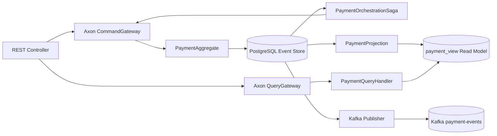

# Axon Saga Orchestration PoC - Payment Processing

PoC en **Java 25**, **Spring Boot**, **Axon Framework sin Axon Server**, **PostgreSQL** y **Kafka**. Implementa un microservicio REST con DDD, arquitectura hexagonal, CQRS, Event Sourcing y Saga por **orquestación** con compensaciones.

## Funcionalidad

El caso de uso es procesamiento de pagos:

1. Se crea un pago.
2. La Saga orquestadora reserva fondos.
3. La Saga valida fraude.
4. Si fraude aprueba, captura el pago.
5. Si fraude rechaza, ejecuta compensación: libera fondos y cancela el pago.
6. Si falla la reserva, cancela el pago.

## Arquitectura



## Estructura

```text
src/main/java/com/edgarrt/poc/payments
├── domain
│   ├── command        # Commands Axon
│   ├── event          # Domain events
│   ├── query          # Queries Axon
│   └── model          # Aggregate y enums de dominio
├── application
│   ├── orchestration  # Saga orquestadora
│   ├── projection     # Read model CQRS
│   └── query          # Query handlers
└── infrastructure
    ├── config         # Configuración Axon sin Axon Server
    ├── kafka          # Publicación externa a Kafka
    └── rest           # Endpoints REST

infraestructura
├── docker             # docker-compose.yml
├── requests           # Requests HTTP de prueba
└── datasets           # Scripts de datos iniciales
```

## Datos de axon

Axon Server está deshabilitado:

```yaml
axon:
  axonserver:
    enabled: false
```

La PoC usa PostgreSQL como Event Store mediante `JdbcEventStorageEngine`.

## Requisitos

- Java 25
- Maven 3.9+
- Docker / Docker Compose
- IntelliJ IDEA

## Levantar infraestructura

```bash
cd infraestructura/docker
docker compose up -d
```

Servicios:

- PostgreSQL: `localhost:5432`
- Kafka: `localhost:9092`
- Kafka UI: `http://localhost:8081`

## Ejecutar aplicación

Desde la raíz:

```bash
mvn spring-boot:run
```

O importar el proyecto en IntelliJ IDEA y ejecutar:

```text
com.edgarrt.poc.payments.PaymentApplication
```

## Endpoints

### Crear pago exitoso

```http
POST /payments/v1/payments
Content-Type: application/json

{
  "customerId": "CUST-001",
  "merchantId": "MERCH-001",
  "amount": 120.50,
  "currency": "PEN"
}
```

Respuesta:

```json
{
  "paymentId": "uuid",
  "status": "PAYMENT_ORCHESTRATION_STARTED"
}
```

### Crear pago con compensación

```http
POST /payments/v1/payments
Content-Type: application/json

{
  "customerId": "RISK-001",
  "merchantId": "MERCH-001",
  "amount": 100.00,
  "currency": "PEN"
}
```

Flujo esperado:

```text
PaymentCreatedEvent
FundsReservedEvent
FraudRejectedEvent
FundsReleasedEvent
PaymentCancelledEvent
```

### Consultar pago

```http
GET /payments/v1/payments/{paymentId}
```

### Listar pagos

```http
GET /payments/v1/payments
```

## Código principal

### PaymentAggregate

Recibe commands, valida reglas de negocio y emite eventos:

- `CreatePaymentCommand`
- `ReserveFundsCommand`
- `ApproveFraudCommand`
- `RejectFraudCommand`
- `CapturePaymentCommand`
- `ReleaseFundsCommand`
- `CancelPaymentCommand`

### PaymentOrchestrationSaga

Es el orquestador central. Escucha eventos y decide el siguiente command. También ejecuta compensaciones.

### PaymentProjection

Construye el read model `payment_view` desde los eventos.

### PaymentQueryHandler

Resuelve consultas usando `QueryGateway`:

- `FindPaymentByIdQuery`
- `ListPaymentsQuery`

## Datasets

Ver:

```text
infraestructura/datasets/README.md
```

Incluye clientes simulados:

- `CUST-001`: flujo aprobado.
- `RISK-001`: flujo rechazado por fraude con compensación.

## Notas

Se Kafka como broker de integración externa para publicar eventos de pago, pero la orquestación principal la maneja Axon mediante Saga y Event Store en PostgreSQL.
